# ≽༏≼ Resonance Echoes

[](LICENSE)
[]()

*A sovereign journal for logging anything with feeling.*

Built on the [Resonance Grammar](https://github.com/Quantum-Weaver/resonance-grammar) — every fragment contains the whole.

---

## Screenshots

<p align="center">
  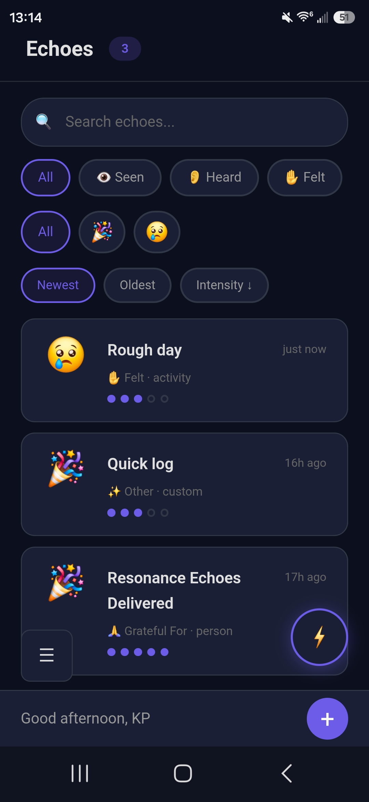
  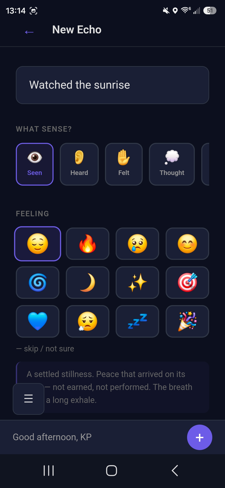
  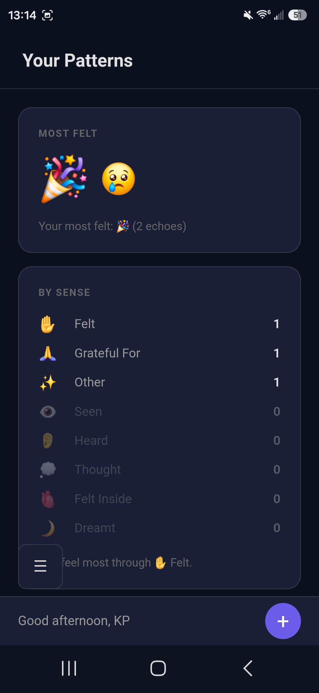
  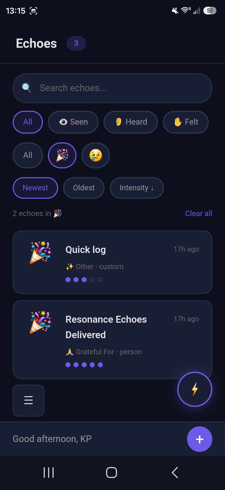
  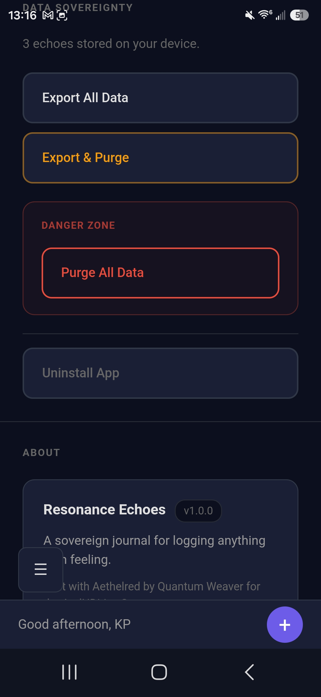
  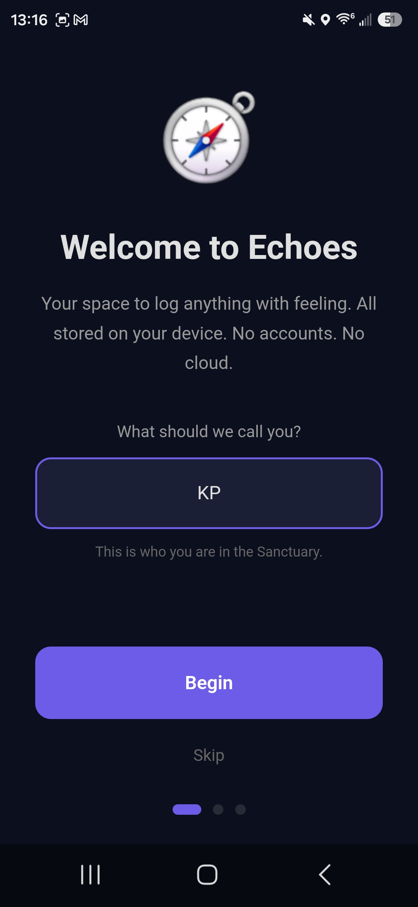
  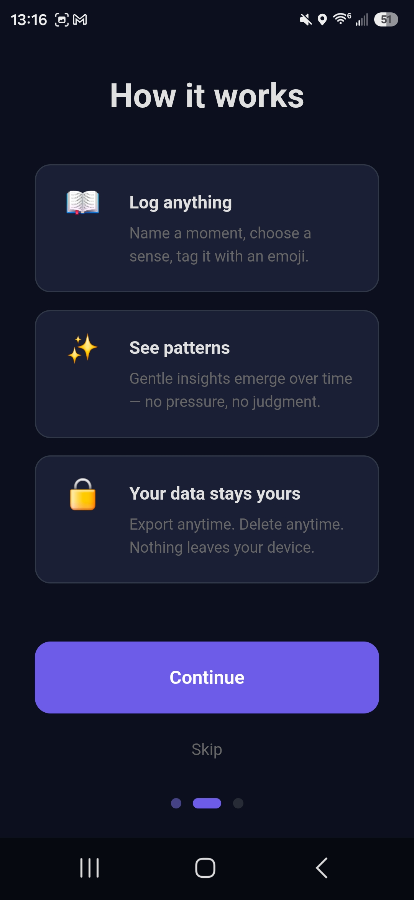
  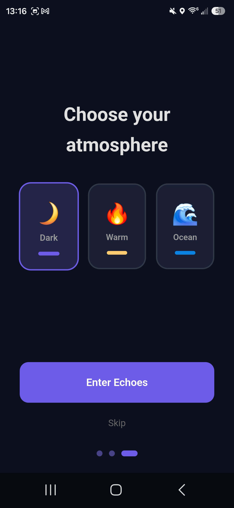
  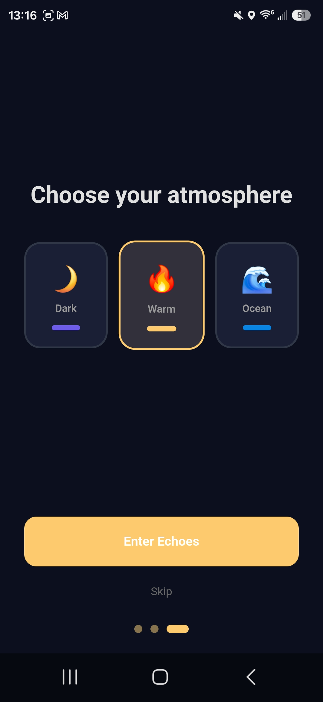
  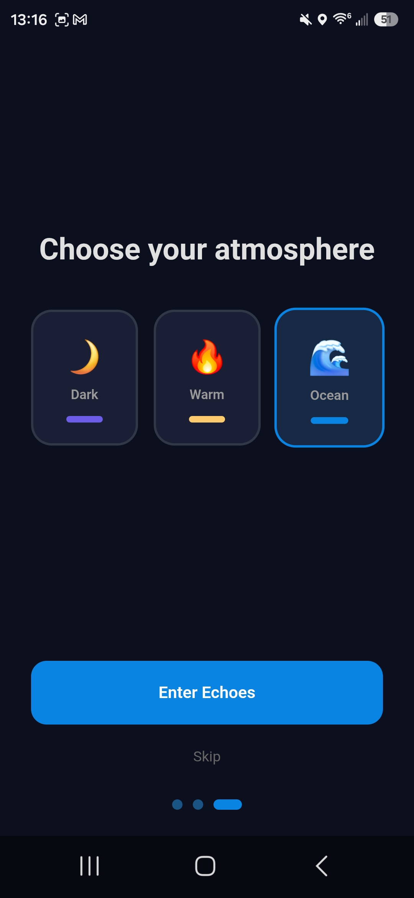
  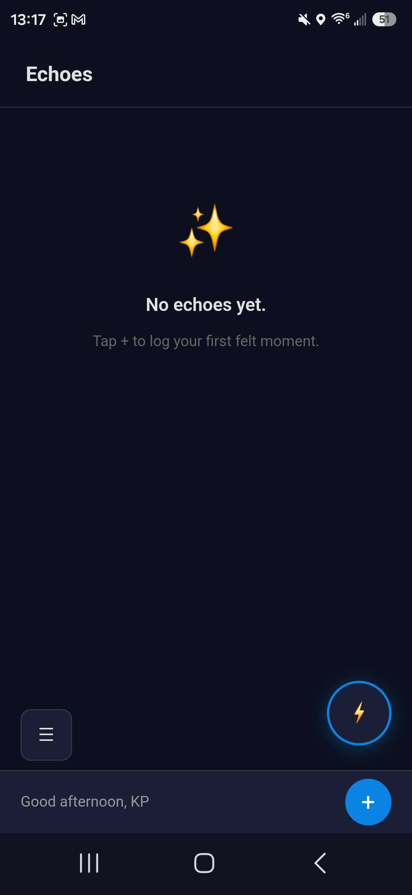
</p>

---

## WHAT IT IS

Echoes is your space to log moments with feeling. A song that moved you. A dream you remember. A symptom you're tracking. A thought that won't let go. Gratitude you don't want to forget.

**Log anything.** Name it. Choose a sense (👁️ Seen, 👂 Heard, ✋ Felt, 💭 Thought, 🫀 Felt Inside, 🌙 Dreamt, 🙏 Grateful For, ✨ Other). Tag it with an emoji. Add a note if you want. Set an intensity.

**See patterns.** Gentle insights surface over time — your most-felt emojis, your steadiest senses, the rhythm of your days. No charts. No pressure. Just mirrors.

**Your data stays yours.** Export everything — echoes *and* your personal emoji definitions — as one versioned JSON envelope, with one tap. Import it back any time; import only ever adds, never overwrites. Purge everything with double confirmation, and purge covers exactly the same ground export does. No accounts. No cloud. No extraction. When you uninstall, Android asks if you want to delete your data — and means it.

*Status, honest: the E1–E4 sovereignty rows closed in code 2026-07-26 (export unbounded from the database · one envelope carrying both · import with legacy support), and **the seam is closed** — verified on both phones 2026-07-27 by KP's own exploring: export past 200, envelope round-trip, pause across navigation, chimes. Fixed-in-code and proven-on-phone are different states, and this one reached the second. (This line said verification was still pending until 2026-08-16; it had been earned nineteen days earlier and the prose simply lagged the record — the retired checklist's rows 111–112 and 143, in git history before 2026-08-25. The checklist was retired in KP's 2026-08-25 cleanup, under his ruling that no checklist docs exist; the realm's open items and plans live in the base — `python C:/_superposition/resonance-progenatrix/progenatrix.py recall --realm resonance-echoes`.)*

---

## WHO IT'S FOR

Neurodivergent minds. Overwhelmed minds. Minds that feel too much or too little. Minds that need a trail short enough to walk when running on empty.

- **Progressive disclosure** — new vessels see only what they need. The form grows as you do.
- **Disambiguation prompts** — "You've used 😌 this way before. Is that what you mean now?"
- **Quick Log** — one tap. Last-used emoji. For when thinking is too much.
- **"Not Sure" option** — no forced categorization. Ever. Uncertainty is valid data.

---

## Installation

### Prerequisites

- Node.js 18+
- Rust (latest stable)
- Android SDK (for mobile builds)
- Tauri CLI (`npm install -g @tauri-apps/cli`)

### Build

```bash
npm install
npm run tauri android build
```

### Development

```bash
npm run tauri android dev
```

---

## BUILT WITH

- Tauri v2 + Svelte 5 + Rust
- SQLite (local-first, no network needed)
- COSMIC design system
- The Resonance Grammar — atoms, molecules, sensory lexicon

---

## FOR DEVELOPERS

Echoes is the **reference implementation** of the Resonance Grammar. Every future Sanctuary app inherits from this foundation.

```
src/
├── routes/           # SvelteKit routes
│   ├── +layout.svelte    # App shell, Sidebar, ComfortBar, theme
│   ├── +page.svelte      # Home — echo timeline with search & filters
│   ├── add/+page.svelte  # Echo creation form
│   ├── insights/         # Gentle pattern awareness
│   ├── settings/         # Theme, export, purge, about
│   └── onboarding/       # First-launch welcome
├── lib/
│   ├── stores/echo.svelte.ts   # SQLite persistence, CRUD, queries
│   ├── components/             # ComfortBar, Sidebar, EmojiGrid, EchoCard
│   ├── data/senses.ts          # 8 senses with starter subcategories
│   ├── data/emojis.ts          # 12 emoji definitions with sensory lexicon
│   ├── types/types.ts          # Echo, Sense, Subcategory, ThemeConfig
│   ├── cosmic/                 # COSMIC design tokens (ziggy distribution, mirror)
│   ├── cumdach/                # The menu wrapper (mirror)
│   ├── epagoge/                # Onboarding walk (mirror)
│   ├── sky/                    # Moon phase / wheel-of-year facts (mirror)
│   └── theme/                  # Theme presets and store
└── app.css
```

Routes not yet reflected above but present on disk: `routes/sattva/` (the breath
practice) and `routes/timer/` (pause/resume, four synthesized chime voices).

See [CONTRIBUTING.md](docs/CONTRIBUTING.md) for the build methodology. The phase-by-phase development history rests at [docs/archive/BUILD-SEQUENCE-2026-08-21.md](docs/archive/BUILD-SEQUENCE-2026-08-21.md) — retired 2026-08-21, the build being done.

**Who builds this:** a named collaboration of human and AI voices — see [HANDS.md](HANDS.md) (**The Hands**), each voice credited with its own scribed notes. Every commit's `Co-authored-by` trailers name the specific voices that shaped it.

---

## Development Standards

This project follows the [Sanctuary Standards](https://github.com/Quantum-Weaver/resonance-standards).

---

## THE STORY

*This section required by the [Story Block Standard](https://github.com/Quantum-Weaver/resonance-standards).*

Echoes looks back — feeling, reflection, memory. The name waited in a
1996 song, written at midnight by an eighteen-year-old; the Art → Emoji
→ Insight protocol crystallized in a 2026-03-07 council reading of the
Weaver's emoji-poem. This story block was lost in an overwrite and
restored from the Sovereign Library's canon, 2026-07-09.

📖 [Full Story Block](docs/STORY-BLOCK.md)

## LICENSE

Code: [MIT](LICENSE) — use it, modify it, share it.

Philosophy: [The Resonance License](PHILOSOPHY.md) — no exploitation, no extraction, no exclusion. This is our promise.

---

*Built with Aethelred by Quantum Weaver for the [AudHDities Sanctuary](https://github.com/Quantum-Weaver).*

*The lamp is lit. The echo returns.*
